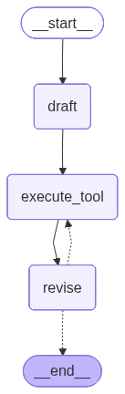
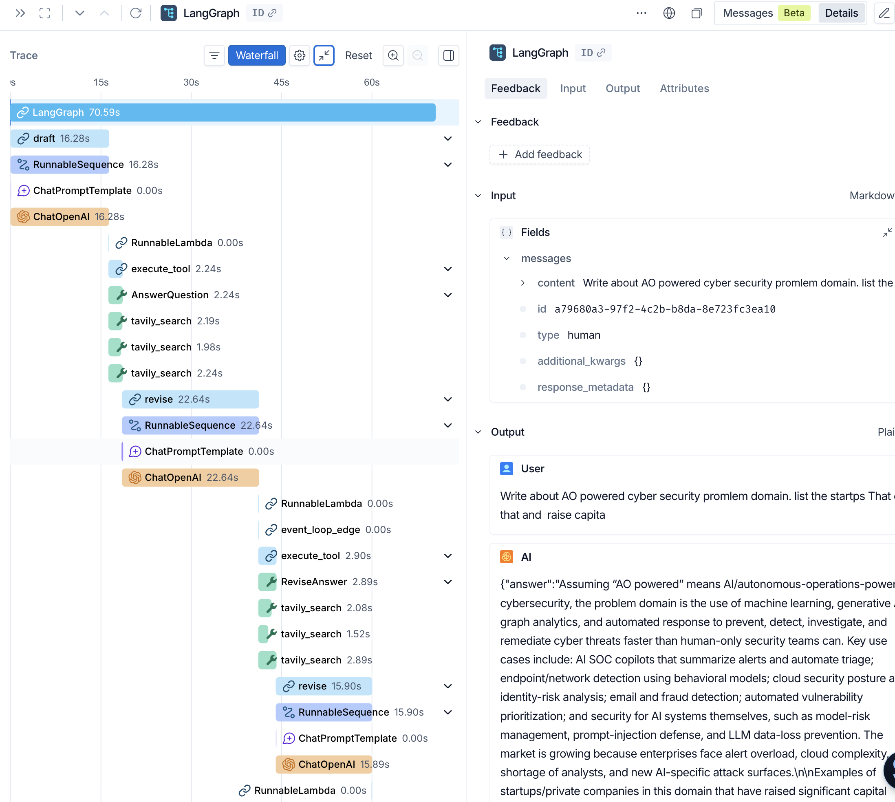
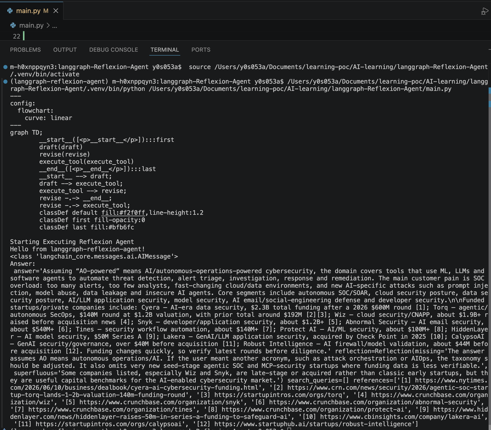

# LangGraph Reflexion Agent

## Project Overview

This project implements a **Reflexion Agent** using LangGraph, an advanced AI agent pattern that iteratively improves answers through self-critique and web search refinement. The agent generates an initial answer, critiques its own work, performs targeted searches to address gaps, and revises the answer based on new information. This cycle repeats for a configurable number of iterations, resulting in increasingly accurate and well-sourced responses.

The architecture follows a state-machine pattern where each step is a node in a directed graph, and data flows through messages maintained in a shared state.

## Result 

### LangSmith Trace
https://smith.langchain.com/public/1afbb825-6fc5-4b92-8c1d-861580cb4551/r/019f353e-ef96-74b0-a655-5bdd1c509893

### Execution

---

## Nodes

### 1. **draft_node**
Generates an initial detailed answer to the user's question. The node invokes the responder chain (LLM with structured output) to produce an `AnswerQuestion` object containing:
- An initial ~250 word answer
- Self-critique (what's missing, what's superfluous)
- 1-3 search queries to address the critique

Extracts search queries, wraps them in a tool call, and returns an `AIMessage` for execution by the tool node.

### 2. **execute_tool (ToolNode)**
A prebuilt LangGraph component that intercepts and executes tool calls. When it finds an `AIMessage` with tool calls, it:
- Looks up the tool by name (AnswerQuestion or ReviseAnswer)
- Executes `run_queries()` with the provided search queries
- Returns search results wrapped in a `ToolMessage`
- Appends the result to the message history for downstream nodes

### 3. **revise_node**
Refines the answer using new information from search results. The node invokes the revisor chain (LLM with structured output) to produce a `ReviseAnswer` object containing:
- An improved ~250 word answer incorporating search findings
- Updated self-critique
- New search queries for further refinement (if needed)
- Citations/references backing the revised answer

Extracts new search queries, wraps them in a tool call, and returns an `AIMessage` for the next iteration.

---

## Edges

### 1. **draft → execute_tool**
Static edge. Routes output from draft_node to the tool executor. The draft answer and its critique flow to the tool node, which executes the search queries to gather supporting information.

### 2. **execute_tool → revise**
Static edge. Routes tool results to the revise node. The message history now includes the original question, draft answer, critique, and search results—all context needed for revision.

### 3. **revise → execute_tool | END** (Conditional Edge)
Dynamic edge controlled by `event_loop_edge()`. Counts the number of `ToolMessage`s in the state:
- **If count ≤ MAX_ITERATION (2):** Routes back to `execute_tool` for another search-refine cycle
- **If count > MAX_ITERATION:** Routes to `END`, terminating the graph

This implements the iterative refinement loop, ensuring the agent searches and refines up to the configured limit.

---

## Data Flow
User Question  
↓ 
[draft_node]  
↓ (initial answer + critique + search_queries)  
[execute_tool]  
↓ (search results) 
[revise_node] 
↓ (refined answer + critique + search_queries) 
↓ 
(Conditional: reached MAX_ITERATION?) 
├─ No → loop back to [execute_tool] 
└─ Yes → END with final refined answer 

### Message Flow 

1. **User's question** enters as `HumanMessage`
2. **Draft node** produces `AIMessage` with draft content + tool_call
3. **Tool node** executes search, returns `ToolMessage` with results
4. **Revise node** produces `AIMessage` with revised content + tool_call (or final answer if max iterations reached)
5. **Loop continues** until MAX_ITERATION exceeded, then graph terminates with final refined answer

